# Debugging

Below are some of the common errors that you will find when using Visual Basic with how to overcome them. If you have an error that is not listed here, use the error panel at the bottom of your screen to help you solve what is wrong.

**Error:**

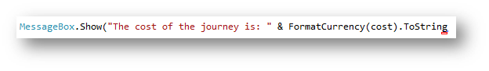
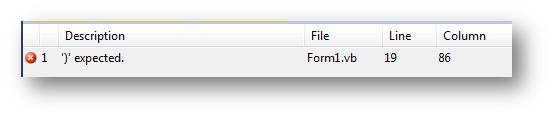

**Reason:** this has happened as there is a missing bracket in your code. Visual Studio will tell you what line it is on. You should look for the blue line to help you find where you need to put it.

**Solution:** Add the speech marks in the correct place. The change on this example is shown below:

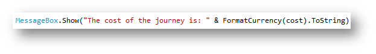

**Error:**

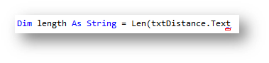
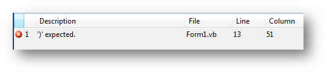

**Reason:** this has happened as there is a missing bracket at the end of the `len` function.

**Solution:** Add the bracket in the correct place. The change on this example is shown below:

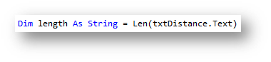

**Error:**

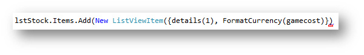
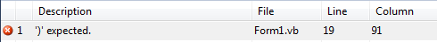

**Reason:** this has happened as there is an incorrect number of close brackets at the end of the line of code. As there is two open brackets (one for adding an item to the list box and one for adding a new item) there needs to be two at the end.

**Solution:** Add the bracket in the correct place. The change on this example is shown below:

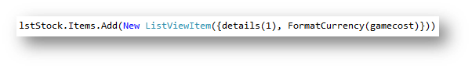

**Error:**

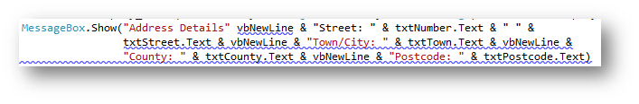
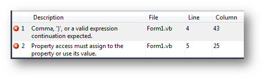

**Reason:** this has happened as the string in the `MessageBox` message has not been joined with `vbNewLine`, a `+` or `&` is missing.

**Solution:** Add the `+` or `&` in the correct place. Visual Studio will normally put a blue underline where the error starts. The change on this example is shown below:

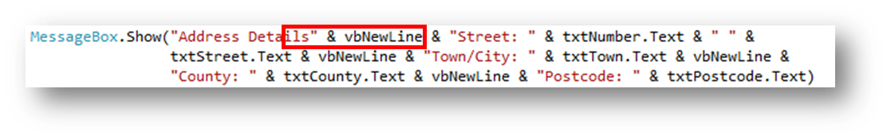

**Error:**

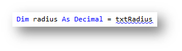
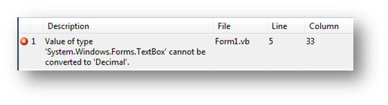

**Reason:** this has happened as you should `.Text` after any form control that you are referring to when coding.

**Solution:** Add `.Text` to the end of the form control. In this scenario it needs to be `txtRadius.Text`The change on this example is shown below:

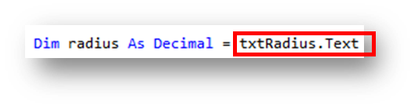

**Error:**

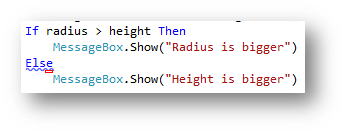
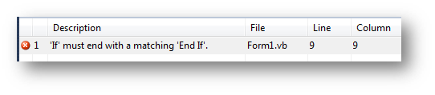

**Reason:** this has happened as an `If` statement must end with an `End If`

**Solution:** Add `End If` at the end of the `If` statement. The change on this example is shown below:

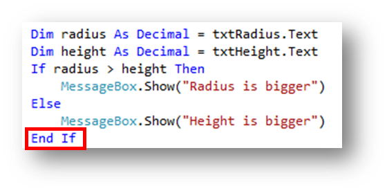

**Error:**

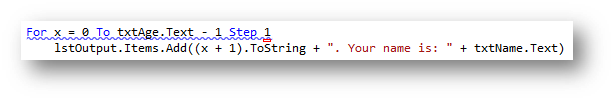
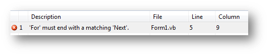

**Reason:** this has happened as a `For` loop must end with `Next`

**Solution:** Add `Next` at the end of the loop. The change on this example is shown below:

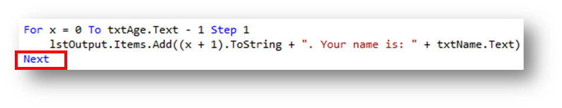

**Error:**

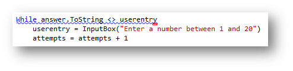
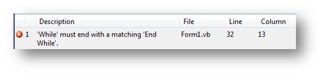

**Reason:** this has happened as a `While` loop must end with `End While`

**Solution:** Add `End While` at the end of the loop. The change on this example is shown below:

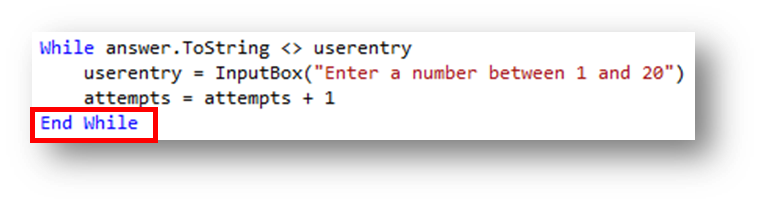

**Error:**

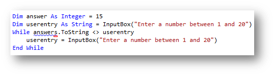
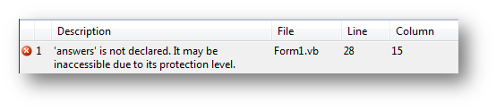

**Reason:** this has happened as the variable name cannot be found. It was declared as `answer` but has been referred to as `answers`, an obvious spelling mistake.

**Solution:** Change the name of the variable to match what you defined it as. The change on this example is shown below:

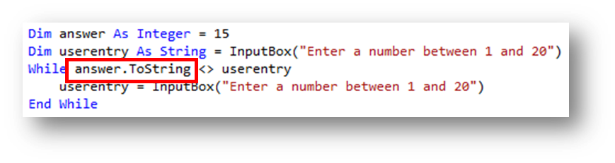

**Error:**

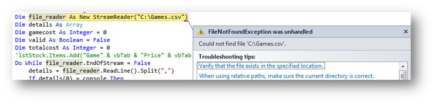

**Reason:** this has happened as the path to the file you are trying to read is incorrect or the file is not in that location

**Solution:** make sure the `.csv` file that you are trying to read is in the path you have specified.

**Error:**

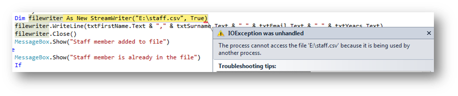

**Reason:** this has happened for one of two reasons, either you have the file open on the computer, or you have been reading/writing to the same file and forgot to close the connection.

**Solution:** close the connection to the file if you were previously reading. In this example the file was being read first using the variable `reader` and then it is attempting to write to the same file using the `filewriter` variable. However the connection from reading has not been closed, therefore `reader.Close()` is needed to close the read connection before opening the write connection. If this is not the problem then check you do not have the file open on your computer.

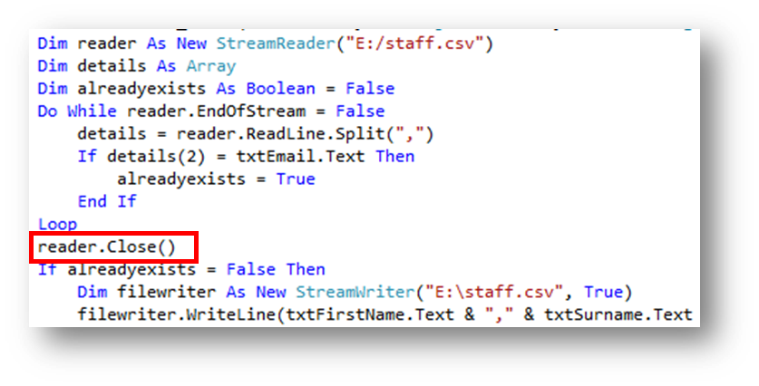
